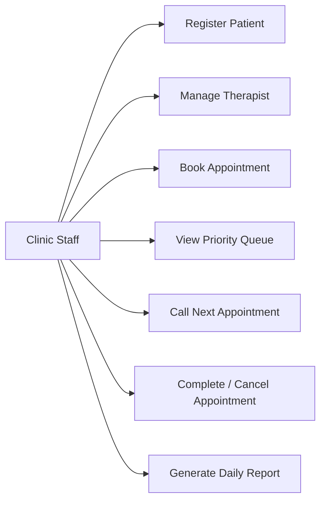
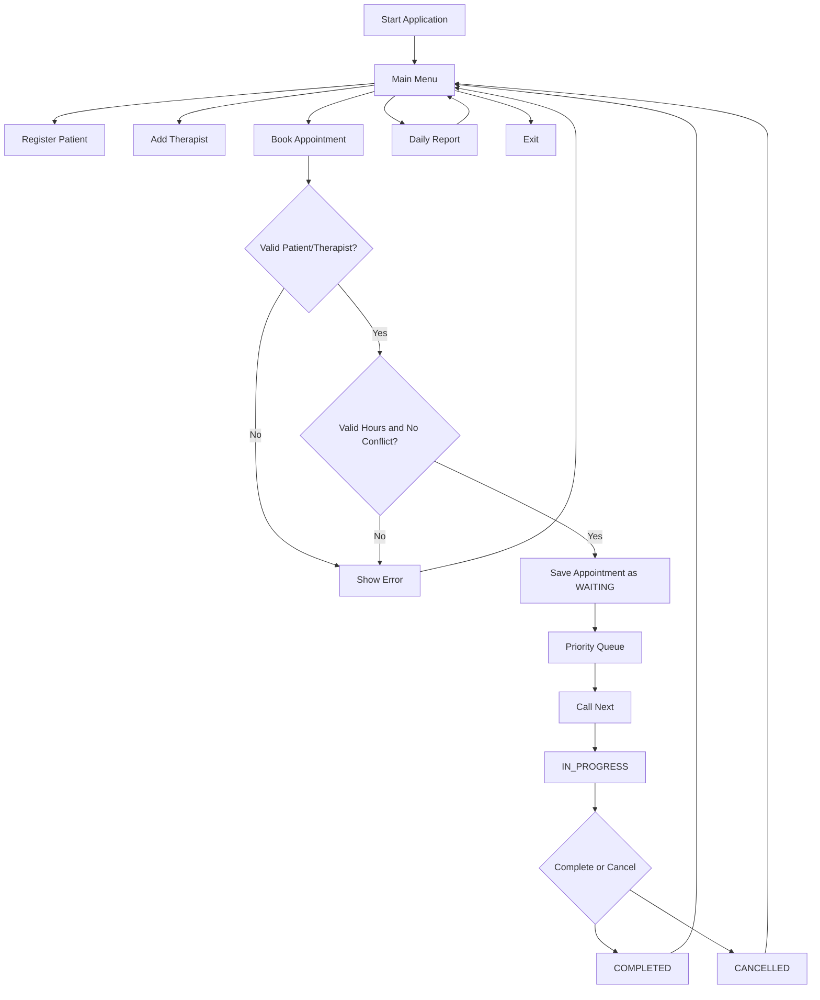
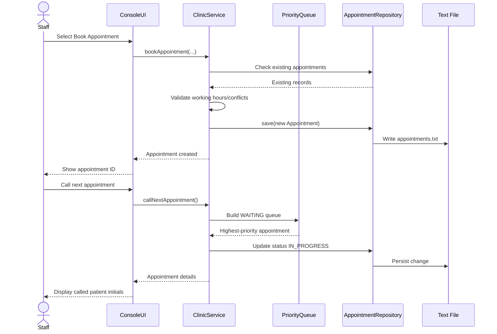
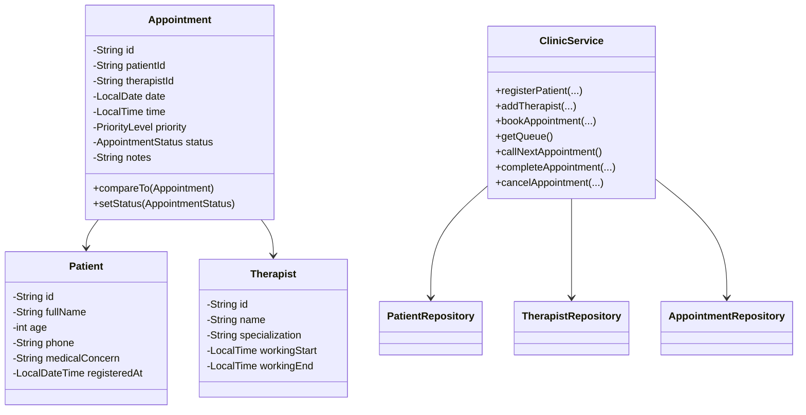

# Design Diagrams

The repository also contains Graphviz `.dot` files under `/diagrams` for generating PNG/SVG diagrams.

## 1. Use Case Diagram



## 2. Workflow Diagram



## 3. Sequence Diagram



## 4. Class Diagram



## 5. ER/Storage View

The project uses file storage rather than a relational database. The logical relationships are:

```text
PATIENT (patient_id, name, age, phone, concern)
       1
       |
       | has many
       v
APPOINTMENT (appointment_id, patient_id, therapist_id, date, time, priority, status, notes)
       ^
       | many-to-one
       |
THERAPIST (therapist_id, name, specialization, start_time, end_time)
```
